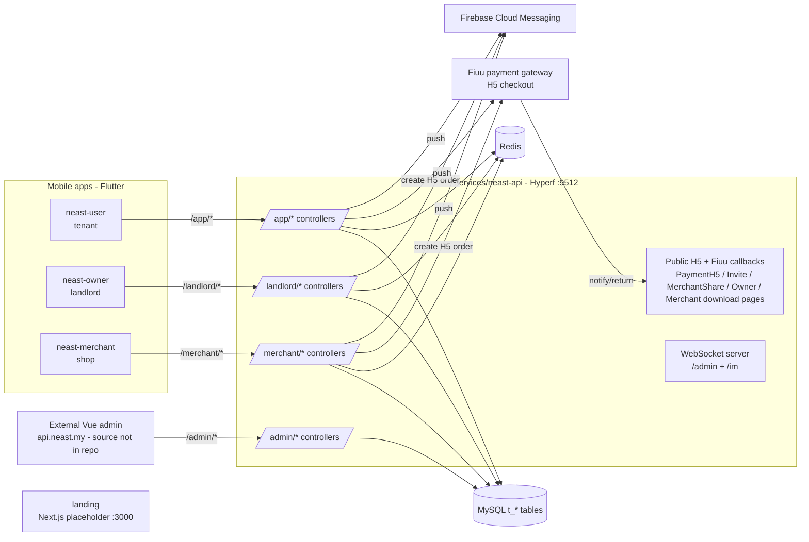

# NEAST Apps & API — How Everything Works Together

> **⚠️ Flutter-era inventory (historical reference).** The mobile apps have been rebuilt in Expo / React Native. Mobile-side paths below (`apps/*/lib`, Riverpod/go_router/dio) describe the retired Flutter apps. For the current structure see `apps/<app>/app/` (Expo Router routes), `apps/<app>/src/features/`, `apps/<app>/src/lib/endpoints.ts`, and `apps/<app>/PARITY.md`. Omissions and known deviations from Flutter parity: `docs/rn-migration-notes.md`. The API-side (`services/neast-api`) content remains accurate.

**Scope:** `neast-monorepo/` — 3 Flutter mobile apps, 1 Next.js landing page, 1 PHP (Hyperf) backend API.
**Audience:** new engineers, PMs, and anyone tracing a flow across apps.
**Sources:** verified against `apps/*/lib`, `services/neast-api/app`, and `.cursor/skills/feature-map/*`. For the money-routing caveats see `docs/flows-and-issues.md`.

---

## 1. The big picture

NEAST is a Malaysian rental + loyalty platform with three user roles, each with its own mobile app:

| App | Role | What it's for |
|---|---|---|
| **neast-user** (`apps/neast-user`) | Tenant / end user | Pay rent, top up wallet, earn & spend points, redeem vouchers, browse merchants, refer friends |
| **neast-owner** (`apps/neast-owner`) | Landlord | List properties, bind tenants, acknowledge rent receipts, track portfolio, keep bank details on file |
| **neast-merchant** (`apps/neast-merchant`) | Shop / merchant | Scan customer QR, award points, burn vouchers, pay monthly platform fee, daily closing |
| **landing** (`apps/landing`) | Public | Placeholder "Coming soon" page |
| **neast-api** (`services/neast-api`) | Backend | Single Hyperf (PHP 8 / Swoole) REST API serving all three apps + an external Vue admin |

The apps never talk to each other directly. **All coordination happens through the API and the shared MySQL database** — one app writes a row, another app reads it later (see §10).



**Key fact:** the API is one codebase partitioned by URL prefix. The first path segment decides which audience the endpoint serves and which auth guard applies.

---

## 2. Shared conventions (all three apps)

| Convention | Value |
|---|---|
| Response envelope | `{ code, message \| msg, data }`; success = `code == 200` |
| Auth header | `Authorization: <raw token>` — **no** `Bearer ` prefix |
| Token refresh | Business `code == 400` triggers `POST .../auth/refresh-token?refreshToken=` |
| Logged-in check | Non-empty `refresh_token` in SharedPreferences |
| Phone format | Country code + digits concatenated **without** `+` (`+60` → `60…`) |
| Local base URL | `http://10.0.2.2:9512` in each app's `lib/core/constants/app_constants.dart` (Android emulator loopback to the Hyperf container) |
| Uploads | Chunked upload (`Upload.php` per audience, shared `FileController`) returns a **path**; the model save is a separate JSON call |
| Push | FCM token registered per audience → `UserFcmTokenModel` / `LandlordFcmTokenModel` / `MerchantFcmTokenModel` |
| Client stack | Flutter + Riverpod + go_router + dio; feature code under `lib/features/<feature>/{pages,services,models,widgets}` |

---

## 3. The backend — `services/neast-api` (Hyperf, port 9512)

### 3.1 Audience routing

| URL prefix | Controller dir | Consumed by |
|---|---|---|
| `/app/*` | `app/Controller/Http/App/` | neast-user |
| `/landlord/*` | `app/Controller/Http/Landlord/` | neast-owner |
| `/merchant/*` | `app/Controller/Http/Merchant/` | neast-merchant |
| `/admin/*` | `app/Controller/Http/Admin/` | External Vue admin (source **not** in this repo) |
| public / H5 | `app/Controller/*.php` (root) | Browsers, Fiuu callbacks, app-store landing pages |
| `ws` server | `app/Controller/WebSocket/` | `/admin` and `/im` sockets (registered in `config/routes.php`) |

### 3.2 Controller inventory

**`/app/*` (tenant):** `Auth`, `User`, `Home`, `Rent`, `Wallet`, `Payment` (fee quotes), `Reward`, `Points`, `Coupon`, `Merchant` (browse), `Refer`, `Message`, `Push`, `Upload`, `Config`, `Agreement`.

**`/landlord/*` (owner):** `Auth`, `Info` (profile + bank detail), `Home`, `Property`, `BindRequest`, `Ack`, `Record`, `Portfolio`, `Rent` (terminate), `Message`, `Push`, `Upload`, `Config`, `Agreement`.

**`/merchant/*` (shop):** `Auth`, `Info` (read-only shop profile), `Coupon` (verify/redeem), `GivePoints`, `PointsSetting`, `Settlement`, `Wallet`, `DailyClosing`, `Transaction`, `Message`, `Push`, `Upload`, `Config`, `Agreement`.

**`/admin/*` (ops, external UI):** `Auth`, `Dashboard`, `User`, `Landlord`, `Rent` (audit + settle), `Merchant`, `MerchantCategory`, `Coupon`, `CouponCategory`, `PointsSetting`, `RewardTier`, `Banner`, `WebsiteImage`, `Employee`, `Role`, `Permission`, agreement controllers, `Upload`.

**Public / H5 (no app token):**

| Controller | Purpose |
|---|---|
| `PaymentH5Controller` | Fiuu H5 pay pages + `notify`/`return` callbacks (production: `https://api.neast.my/wallet/topup/notify\|return`) |
| `InviteController` | `GET /invite` — referral landing page with App Store / Google Play buttons |
| `MerchantShareController` | Shared merchant web page (backs in-app merchant sharing / deep links) |
| `OwnerController` | `GET /owner` — owner-app download landing page |
| `MerchantController` | `GET /merchant` — merchant-app download landing page |
| `WebsiteImageController` | Public website/banner images |
| `FileController` | Shared chunked upload |
| `IndexController` | Health / index |

### 3.3 Data layer

Models in `app/Model/` map 1:1 to `t_*` MySQL tables; per-table dumps live in `services/neast-api/sql/` (mounted into MySQL initdb by the root `docker-compose.yml`). The important entities:

- **Identity:** `UserModel`, `LandlordModel`, `MerchantModel`, `AdminModel` (+ roles/permissions)
- **Rent:** `RentModel` (`t_rent`), `RentHistoryModel`, `LandlordPropertyModel`
- **Money:** `UserTopupModel`, `MerchantTopupModel`, `MerchantBillModel`, `MerchantBalanceLogModel`
- **Loyalty:** `UserPointsModel`, `PointsLogModel`, `PointsSettingModel`, `GivePointsRecordModel`, `CouponModel`, `CouponCategoryModel`, `UserCouponModel`, `CouponMerchantModel`, `RewardTierModel`
- **Engagement:** `*MessageModel`, `*FcmTokenModel`, `BannerModel`, `WebsiteImageModel`, `*AgreementModel`, `UserActiveModel`, `UserChangeLogModel`

---

## 4. App 1 — `neast-user` (tenant)

**Package `neast` · API prefix `/app` · Tabs: Home, Pay rent, Reward, Account**

### 4.1 Purpose & auth

The tenant's everything-app: rent payment, wallet, loyalty points, vouchers, merchant discovery, referrals.

- **Auth:** phone OTP only. `GET /app/auth/country-codes` → `POST /app/auth/send-code {account}` → `POST /app/auth/login {account, code}`. **No register screen** — login upserts the account. New users are pushed to the first-profile form after verifying.
- **Guest mode:** splash, login, verify, main tabs, merchant list/map, and the coupon catalog work logged-out. Wallet, rent pay, merchant **detail**, points, My QR, notifications, refer, and the scanner require login (guests see a login CTA placeholder).
- **Deep links:** `neastuser://merchant/{id}` and `https://<host>/merchant/{id}` open merchant detail; if logged out, the route is stashed (`pending_route_provider.dart`) and replayed after login.

### 4.2 Page inventory & navigation map

Shell: `/splash` → `/` (`MainScreen`, 4 tabs). Routes are constants in `lib/core/router/routes.dart`.

**Tab 1 — Home** (`features/home/pages/home_screen.dart`, `GET /app/home/dashboard`)

| Link target | Route | Trigger widget |
|---|---|---|
| Login (guest CTA) | `/login` | home header |
| My QR | `/account/my-qr` | header QR button |
| Notifications | `/notification` | bell icon |
| Merchant map | `/merchants/map` | "Nearby deals" / deal sections |
| Merchant detail | `/merchant/:id` | deal card tap |
| Coupon catalog | `/coupon` | "Today's reward" card |
| Tent Score | `/account/tent-score` | journey streak card |
| My vouchers | `/coupon/my-vouchers` | voucher card |

**Tab 2 — Pay rent** (`features/pay_rent/pages/pay_rent_screen.dart`)

| Page | Route | Purpose | API |
|---|---|---|---|
| Add tenancy | `/pay-rent/create` | Create tenancy; optional "Connect With Owner" scan of the owner's property QR → property lookup | `GET /app/rent/property?sn=`, `POST /app/rent/create` |
| Tenancy detail | `/pay-rent/detail` | Status, schedule, Pay Now (only when `can_pay == true`) | rent detail |
| Rent payment | `/pay-rent/payment` | Choose wallet or Fiuu H5 (FPX/TNG/Grab/Visa) | `POST /app/rent/pay/wallet`, `POST /app/rent/pay/create` |
| Fiuu WebView | `/pay-h5-webview` | Hosted checkout; on return, poll history for `status == 1 \|\| 2` | `GET /app/rent/history/list` |
| Rent history | `/pay-rent/history` | Monthly payment rows | `GET /app/rent/history/list` |
| History detail / status | `/pay-rent/history/detail` | Payment status screen | — |
| Owner invite | `/pay-rent/invite-owner` | Invite a landlord who isn't on NEAST yet | share invite H5 |

**Tab 3 — Reward** (`features/reward/pages/reward_screen.dart`, `/app/reward/dashboard`)

| Link target | Route |
|---|---|
| Points home | `/points` |
| Reward tiers | `/reward/tier` |
| Merchant map / detail | `/merchants/map`, `/merchant/:id` |
| Coupon catalog | `/coupon` |

**Tab 4 — Account** (`features/account/pages/account_screen.dart`)

| Page | Route | Purpose | API |
|---|---|---|---|
| Personal data | `/personal-data` → `/personal-data/edit` | View/edit profile fields | `GET/POST /app/user/profile` |
| My QR | `/account/my-qr` | Identity QR (backend `qrCode` string) scanned by the **merchant app** | `GET /app/user/profile` |
| Wallet | `/wallet` → `/wallet/payment` → `/pay-h5-webview` | Balance + Fiuu top-up; no withdraw | `GET /app/wallet/balance`, `POST /app/wallet/topup/create` |
| Notifications | `/notification` | Message list | `Message.php` |
| Privacy / Terms | `/rich-text` | Agreement pages | `Agreement.php` |
| Delete account | (dialog) | 10s countdown, implemented | `POST /app/user/delete-account` |

**Cross-cutting pages**

| Page | Route | Purpose | API |
|---|---|---|---|
| Points home | `/points` | Balance, earn/redeem entries | `UserPointsModel` data |
| Points history | `/points/history` | Points ledger | points logs |
| Refer a friend | `/refer` | Share referral invite H5 | `Refer.php` → `/invite` page |
| Coupon catalog | `/coupon` → `/coupon/detail` | Spend points on vouchers | `POST /app/coupon/redeem {coupon_id}` |
| My vouchers | `/coupon/my-vouchers` | Owned vouchers + QR code for merchant to burn | `UserCouponModel` |
| Merchant list | `/merchants` | Browse by category (guest OK) | `Http/App/Merchant.php` |
| Merchant map | `/merchants/map` | Nearby merchants (guest OK) | same |
| Merchant detail | `/merchant/:id` | Shop detail (login required) | same |
| QR scanner | `/scanner` | Scan owner property QR (rent bind) | — |
| Verify OTP | `/verify` → `/full-data` | OTP entry; first-profile form for new accounts | `POST /app/auth/login`, `POST /app/user/profile` |

---

## 5. App 2 — `neast-owner` (landlord)

**Package `neast_landlords` · API prefix `/landlord` · Tabs: Home, Properties, Records, Account · No guest mode**

### 5.1 Purpose & auth

The landlord's ops console: see which tenants owe/paid, approve bind requests, acknowledge received rent, manage properties, and keep payout bank details on file.

- **Auth:** phone OTP with a scene flag. `POST /landlord/auth/send-code {phone, scene}` where `scene = login | register`; new landlords go through `POST /landlord/auth/register {phone, code, first_name, last_name}`.
- **Important honesty note:** the owner **acknowledges** rent (`ack/confirm`) — this is a queue confirmation, not a bank payout. Money sits at NEAST until ops settles offline (see `docs/flows-and-issues.md` §3).

### 5.2 Page inventory & navigation map

Shell: `/splash` → `/login` → `/verify` → `/` (`MainScreen`, 4 tabs).

**Tab 1 — Home** (`features/home/pages/home_screen.dart`, `GET /landlord/home/detail`)
Shows collected amount, collection rate, overdue amount, due-soon list, need-ack list, bind requests, portfolio counts.

| Link target | Route | API |
|---|---|---|
| Rent detail | `/rent-detail` | rent row |
| Ack list → Ack detail | `/ack-list` → `/ack-detail` | `GET /landlord/ack/list`, `POST /landlord/ack/confirm {id}` |
| Bind request list → detail | `/bind-request-list` → `/bind-request-detail` | `GET /landlord/bind-request/list`, `POST /landlord/bind-request/audit {id, result: approved\|rejected}` |
| Portfolio snapshot | `/portfolio-snapshot` | `Portfolio.php` |
| Notifications | `/notification` | `Message.php` |

**Tab 2 — Properties** (`features/properties/pages/properties_screen.dart`)

| Page / action | Route | Purpose | API |
|---|---|---|---|
| Property list | (tab) | All owned properties | `Property.php` list |
| Add property | `/add-property` | Create property; **gated on bank account existing** — the empty state routes to `/bank-detail` first | `Property.php` create |
| Property QR | dialog | Encodes the property `sn` **client-side** (`PropertyQrcodeDialog`); the tenant scans this in "Connect With Owner" | no API |
| Bank detail | `/bank-detail` | `bank_name`, `bank_account`, `account_holder_name`, `bank_header_photo` | `POST /landlord/bank-detail` |

**Tab 3 — Records** (`features/records/pages/records_screen.dart`) — payment records feed via `Record.php`.

**Tab 4 — Account** (`features/account/pages/account_screen.dart`)

| Link target | Route | API |
|---|---|---|
| Bank detail | `/bank-detail` | `POST /landlord/bank-detail` |
| Notifications | `/notification` | `Message.php` |
| Legal pages | `/rich-text` | `Agreement.php` |
| Delete account | (dialog, implemented) | `POST /landlord/delete-account` |

**Portfolio drill-down:** `/portfolio-snapshot` → `/portfolio-tenant-detail` (per-tenant lease view; lease termination via `PUT /landlord/rent/id/{id}/terminate`).

---

## 6. App 3 — `neast-merchant` (shop)

**Package `neast` · API prefix `/merchant` · Tabs: Scan, Give Points, Settlement, Account · No guest mode, no register**

### 6.1 Purpose & auth

The shop-facing terminal: identify customers by QR, award loyalty points, burn vouchers, and pay NEAST the monthly platform fee on points issued.

- **Auth:** email + password (`POST /merchant/auth/login {account, password}`). Accounts are created by admin, not self-serve.
- **Money direction is opposite to rent:** the merchant **pays NEAST** (platform fee on points issued). There is no merchant payout rail.

### 6.2 Page inventory & navigation map

Shell: `/splash` → `/login` → `/` (`MainScreen`, 4 tabs).

**Tab 1 — Scan** (`features/scan/pages/scan_screen.dart` + `/scanner` full-screen scanner)
The scanner branches on QR content:

| Scanned payload | Destination | API |
|---|---|---|
| User identity QR — JSON `{"user_id": <int>}` (from user app's My QR) | Give-points flow (customer lookup) | `GET /merchant/give-points/customer?user_id=` |
| Voucher code (from user app's My Vouchers) | `/redeem-voucher` — verify then burn | `POST /merchant/coupon/verify {code}`, `POST /merchant/coupon/redeem {code}` |

**Tab 2 — Give Points** (`features/give_points/pages/give_points_screen.dart`)

| Page | Route | Purpose | API |
|---|---|---|---|
| Receipt details | `/give-points/receipt-details` | Capture/upload receipt photo + amount | chunked `Upload.php` |
| Confirm points | `/give-points/confirm-points` | Award points at the admin-set rate | `GET /merchant/points-setting` (`yuan_to_points`), `POST /merchant/give-points/confirm {customer, amount, points, merchant_id, notes, receipt_number, receipt_path}` |
| Daily closing | `/daily-closing` | Today's summary + transactions (Export Report is a stub) | `DailyClosing.php` |

**Tab 3 — Settlement** (`features/settlement/pages/settlement_screen.dart`, `GET /merchant/settlement/overview`)

| Page | Route | Purpose | API |
|---|---|---|---|
| Settlement payment | `/settlement/payment` | Pay the monthly platform bill by wallet or Fiuu H5; due date is client-computed (10th of month after `bill_month`) | `POST /merchant/settlement/pay/wallet {bill_id, payment_method}`, `POST /merchant/settlement/pay/create {bill_id, payment_method, payment_channel?}` |
| Fiuu WebView | `/pay-h5-webview` | Hosted checkout (same pattern as user app) | — |

**Tab 4 — Account** (`features/account/pages/account_screen.dart`)

| Link target | Route | Purpose | API |
|---|---|---|---|
| Store profile | `/account/store-profile` | Read-only shop info | `GET /merchant/info` |
| Wallet | `/wallet` → `/wallet/payment` → `/pay-h5-webview` | Top up merchant wallet (spent on platform bills) | `POST /merchant/wallet/topup/create` |
| Invoice & Billing | `/invoice` | Stub ("Please stay tuned.") | — |
| Transaction history | `/transaction-history` | Points given + vouchers redeemed | `/merchant/transaction/points`, `/merchant/transaction/redeemed` |
| Legal | `/rich-text` | Agreements | `Agreement.php` |
| Delete account | (dialog) | **No API** — UI only | — |

---

## 7. Landing — `apps/landing` (Next.js, port 3000)

Single placeholder route `/` (`app/page.tsx`) rendering the NEAST wordmark + "Coming soon." No API calls, statically rendered, served as the `landing` service in the root `docker-compose.yml`. The real public web surfaces today are the API-served H5 pages (`/invite`, `/owner`, `/merchant` download pages, Fiuu H5).

---

## 8. Design system, colors & UI details

### 8.1 Shared foundation (all three Flutter apps)

All three apps use the **same theme code** — a copy of `lib/core/theme/app_colors.dart` (semantic `ThemeExtension`) + `app_theme.dart` (`ThemeData`). Light values are constrained to match historical hardcoded hexes.

**Core palette (identical in every app):**

| Token | Hex | Used for |
|---|---|---|
| `brandBlue` | `#0851AA` | Brand headers, primary text accents |
| `brandBlueLight` | `#234FA5` | Secondary brand accents, selected states |
| `darkGreen` | `#3EBF7A` | Success / paid / positive money states |
| `blackText` | `#0F172A` | Primary text (dark slate, not pure black) |
| `AppTheme.primaryColor` | `#4ADB77` | **Action green** — ElevatedButton background, TextButton foreground, dark-theme seed |
| Dark-mode `brandBlue` | `#0D2567` | Dark variant (placeholder set; `themeModeProvider` defaults to **light**) |

**Chrome & layout (from `app_theme.dart`):**

| Element | Value |
|---|---|
| Scaffold background | `#FFFFFF` light · `#17171B` dark |
| AppBar | `#F5F5F5` background, black icons/title, centered title, 18 pt, elevation 0 |
| Cards | 12 px corner radius, elevation 2 |
| ElevatedButton | 8 px radius, white text on `#4ADB77`, elevation 0 |
| Design flavor | Material 2 (`useMaterial3: false`); **Cupertino page transitions forced on all platforms** |
| Bottom tabs | Selected `#0F172A`, unselected `#B0B0B0`, SVG icons, "Beta" badge on the bar |

**Typography:** two variable fonts declared in each `pubspec.yaml` —
`FD` = **Funnel Display** (display numerals / headings), `HG` = **Host Grotesk** (body text). User and owner use both (`HG` dominates: ~105/91 usages vs ~13/21 for `FD`). **Merchant declares only `FD`** — its three `fontFamily: 'HG'` references silently fall back to the default font.

**Shared semantic colors (hardcoded but recurring):**

| Hex | Meaning |
|---|---|
| `#FF4444` | Error / overdue / destructive |
| `#3EBF7A` · `#1ADB8B` | Success / paid / online |
| `#999999` · `#666666` · `#9CA3AF` | Secondary / hint text |
| `#D0D5DD` · `#E5E7EB` · `#E8ECF0` | Borders / dividers |
| `#F6F9F6` · `#F8FBFF` · `#F2F9FC` | Tinted card / section backgrounds |

### 8.2 neast-user — brand blue + gold loyalty accents

The most colorful of the three: blue brand chrome with a **gold/amber tier** reserved for points and rewards.

| Hex | Where |
|---|---|
| `#0851AA` / `#234FA5` / `#0D2567` | Brand headers, wallet card, primary actions |
| `#D4A853` | "Earn points" chips on rent cards, rent-file/status accents |
| `#B8860B` | Points-deal accent on the merchant map (vs blue for regular deals) |
| `#895A1B` + bg `#FBF6DA` | Reward-tier card text and background |
| `#1ADB8B` | Bright-green success states |
| `#F6F9F6` / `#F8FBFF` | Section backgrounds (home, rent) |

### 8.3 neast-owner — soft blue gradients + warm tan highlights

Cool blue gradient headers on data screens, warm tan/gold gradient for highlight cards.

| Hex | Where |
|---|---|
| `#E3EFFF` → `#79A1D3` | Blue gradient headers: records list, ack list, portfolio snapshot, month picker |
| `#FFF8EC` → `#ECB87D` | Warm gradient highlight cards |
| `#DF4700` | Orange accent (overdue/attention) |
| `#E3A86D` | Tan accent on stats |
| `#E8F0F8` · `#ECF4FF` · `#EAF2FA` · `#F2F9FC` | Blue-tinted surfaces |
| `#ACC4E5` | Muted blue icons/labels |

### 8.4 neast-merchant — corporate blue gradients

Deep-blue gradient cards give the merchant terminal a more "business console" feel.

| Hex | Where |
|---|---|
| `#4A97D4` → `#006EC0` | Scan-tab header gradient |
| `#234FA5` → `#4A82EF` | Give-points customer card gradient |
| `#234FA5` | Selected filter/tab state (transaction history) |
| `#E3A86D` / `#F5C842` | Gold highlights (points, settlement accents) |
| `#FF4444` on `#FDECEC` | Error / failed-transaction rows |
| `#F2F9FC` · `#EBF4FD` · `#E3EFFF` | Blue-tinted surfaces |

### 8.5 Landing — plain dark placeholder

`apps/landing/app/globals.css`: near-black background `#0a0a0a`, off-white text `#FAFAFA`, muted `#888` tagline, system-ui font stack, wordmark at 3 rem with `0.2 em` letter-spacing. No brand assets yet.

---

## 9. How the apps link together — cross-app flows

The apps are coupled through **shared database rows and QR codes**, never direct calls. These are the five flows that connect them.

### 8.1 Rent lifecycle (user ↔ owner ↔ admin)

```mermaid
sequenceDiagram
  participant O as Owner app
  participant U as User app
  participant API as neast-api
  participant AD as Vue admin (external)
  participant F as Fiuu

  O->>API: POST /landlord/property/create
  O->>O: Property QR encodes sn (client-side)
  U->>U: Scan owner QR (Connect With Owner)
  U->>API: GET /app/rent/property?sn=
  U->>API: POST /app/rent/create {amount, file, paid_at, ..., property_id?}
  AD->>API: PUT /admin/rent/id/{id}/audit (approve; landlord bank fields)
  O->>API: POST /landlord/bind-request/audit {id, approved}
  U->>API: POST /app/rent/pay/create {rent_id, payment_method}
  API->>F: H5 order (NEAST merchant account)
  F-->>API: notify → history = paid
  O->>API: POST /landlord/ack/confirm {id}   (queue ack, NOT a payout)
  AD->>API: PUT /admin/rent/history/id/{id}/settle {receipt}  (manual offline transfer)
```

- `t_rent.status`: `0` pending review · `1` approved · `2` rejected · `3` pending bind · `4` terminated. Pay Now only when `can_pay == true`.
- History status: `pending` / `overdue` / `paid` (money at NEAST) / `settled` (ops marked paid-out) / `cancelled`.
- **Known gap:** rent is collected into NEAST's Fiuu account; there is no automated payout rail to landlords. Owner bank details are collected but only reach the rent row if typed at admin audit. Full analysis: `docs/flows-and-issues.md` §3.

### 8.2 Property QR bind (owner → user)

Owner app shows a QR encoding the property `sn` (generated client-side, no API). User app's "Connect With Owner" scanner reads it → `GET /app/rent/property?sn=` → tenancy created with `property_id`. Owner then approves the bind via `/landlord/bind-request/audit`. Unbound tenancies (`owner_name` typed manually) carry no owner bank.

### 8.3 Points: merchant awards, user spends (merchant → user)

1. Admin sets the rate (`PointsSetting` → `yuan_to_points`).
2. User shows **My QR** (Account tab) — encodes the backend `qrCode` string; the merchant scanner requires JSON `{"user_id": <int>}`.
3. Merchant app: scan → `GET /merchant/give-points/customer?user_id=` → receipt upload → `POST /merchant/give-points/confirm`.
4. User sees the balance in Reward → Points (`UserPointsModel` + `PointsLogModel`).

### 8.4 Vouchers: user redeems, merchant burns (user → merchant)

Same backend, opposite verbs:

1. **User:** `POST /app/coupon/redeem {coupon_id}` — points → voucher (`UserCouponModel`), shown in My Vouchers with a code/QR.
2. **Merchant:** scan the voucher → `POST /merchant/coupon/verify {code}` → `POST /merchant/coupon/redeem {code}` (burn).
3. Both sides see the transaction in their history screens.

### 8.5 Wallet & Fiuu H5 (user + merchant → NEAST)

Both apps share the same top-up pattern: create order → `payment_url` → in-app WebView (`/pay-h5-webview`) → Fiuu notify credits the in-app wallet.

- User wallet: top-up in (`UserTopupModel`), rent wallet-pay out. No withdraw.
- Merchant wallet: top-up in (`MerchantTopupModel`), platform-bill payment out (`MerchantBillModel`).
- Client method mapping (`wallet_config.dart`): `fpx`→`fpx`, `tng`→`TNG-EWALLET`, `grab`→`GrabPay`, `visa`→`credit`; FPX bank list in `fpx_bank_config.dart`. `payment_channel` is always the **payer's** bank, never a payee.
- Fee quotes: `GET /app/payment/quote` (display/pricing only, not routing).

### 8.6 Referral (user → public web)

User app's Refer screen (`/refer`) shares the invite H5 (`InviteController`, `REFERR_INVITE_URL`), which renders App Store / Google Play buttons from env config. The API also serves `/owner` and `/merchant` download landing pages the same way.

### 8.7 Push & messaging (API → all apps)

Each app registers its FCM token via its own `Push.php` into a per-audience table. `Message.php` controllers back the in-app notification lists; `WebSocket/AdminController` + `WebSocket/ImController` serve the admin console and IM socket on the `ws` server.

---

## 10. Data ownership matrix — who writes, who reads

| Entity | Written by | Read by |
|---|---|---|
| User account / profile | user app (`/app/user/profile`) | user app, admin, merchant (give-points lookup) |
| Landlord profile + bank | owner app (`/landlord/bank-detail`) | owner app, admin (rent audit — manually) |
| Merchant profile | admin (`/admin/merchant/*`) | merchant app (read-only), user app (browse) |
| Property + `sn` | owner app | owner app, user app (`?sn=` lookup), admin |
| Tenancy (`t_rent`) | user app (create), admin (audit), owner (terminate) | all three + admin |
| Rent history | API (on payment), admin (settle) | user app, owner app (records/ack), admin |
| Wallet top-ups | user / merchant apps via Fiuu H5 | owning app + admin |
| Points | merchant app (award), API (rate) | user app (balance/logs), merchant app (history) |
| Coupons / vouchers | admin (catalog), user app (redeem) | user app (my vouchers), merchant app (verify/burn) |
| Merchant bills | API (monthly generation) | merchant app (pay), admin (`/admin/merchant/bills`) |
| Reward tiers / banners / website images | admin | user app |
| Messages / FCM tokens | API + each app | owning app |

---

## 11. Known stubs and gaps (don't be surprised)

- **No payout rail anywhere:** no withdraw, transfer, or beneficiary API on any surface. Rent settles via manual offline transfer + receipt upload in admin.
- **User app:** coupon share toast, no invoice/receipt PDF, home banner `link` is display-only, logout is local-only.
- **Owner app:** WhatsApp and Generate PDF buttons are empty; no property edit/delete; ack is not proof of payout.
- **Merchant app:** Invoice & Billing, campaigns, auto-deduct, shop edit, register, and delete-account are stubs/copy only; Export Report does nothing.
- **Landing:** placeholder only.

---

## 12. Quick reference

| Surface | Local address | Auth |
|---|---|---|
| API | `http://localhost:9512` (`/health` for ALB/CI) | per-prefix token |
| Landing | `http://localhost:3000` | — |
| User app | prefix `/app` | phone OTP |
| Owner app | prefix `/landlord` | phone OTP + register |
| Merchant app | prefix `/merchant` | email + password |
| Vue admin (external) | `https://api.neast.my` + `/admin` | staff login |

```bash
# Full local stack
cp services/neast-api/.env.example services/neast-api/.env
docker compose up --build   # API :9512 + MySQL + Redis + landing :3000

# Any mobile app
cd apps/neast-user          # or neast-owner / neast-merchant
flutter pub get && flutter run
```
