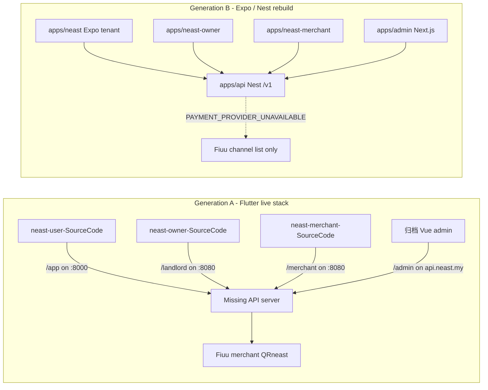
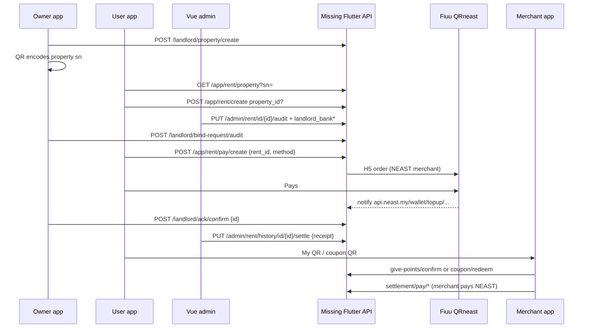
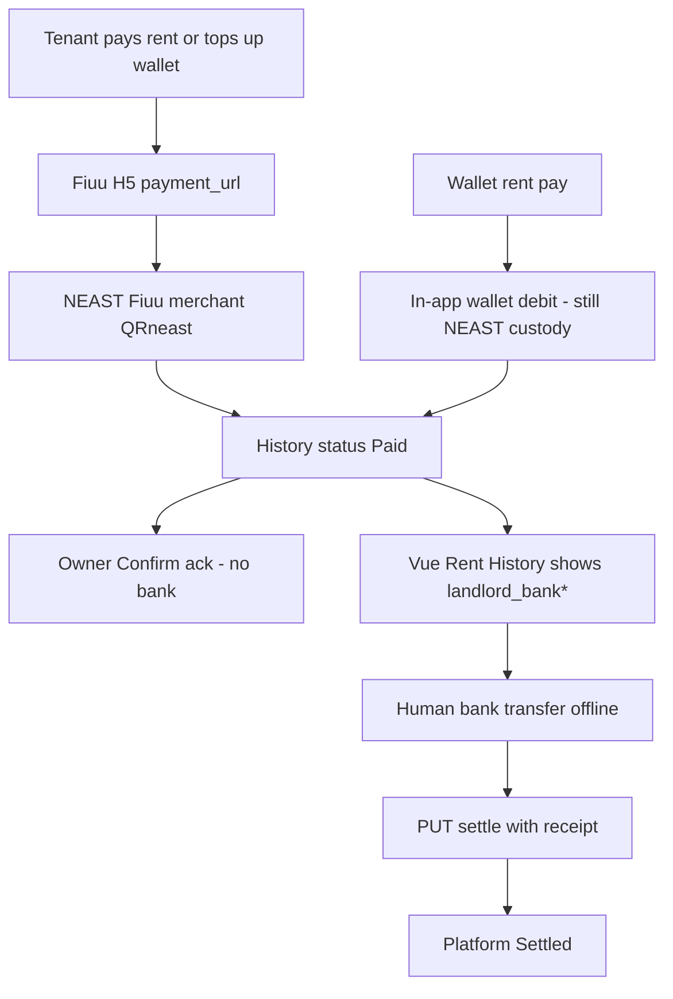

# NEAST Flows and Payment-Routing Issues

**Audience:** founder / PM, then engineering.  
**Date:** 19 September 2026.  
**Method:** verified against Flutter `lib/`, Nest `apps/api`, Expo apps, Next admin, and the compiled Vue admin in `归档/`. No Flutter API server source exists in this workspace. No app code was changed.

---

## Executive verdict (payout routing)

**The user report is true for automated routing, and true from the payment-provider view.** Tenant rent (wallet / Fiuu H5 / FPX / TNG / Grab / Visa) is collected into **NEAST’s Fiuu merchant account**. The Flutter pay-create payloads do **not** attach owner or merchant bank. There is **no** payout, withdraw, transfer, or beneficiary API in any of the three Flutter clients.

**It is not true that the live admin has zero destination data.** The archived Vue admin (`归档`, `https://api.neast.my`) has **Rent List** (approve requires `landlord_bank` / `landlord_bank_account` / `landlord_account_name`) and **Rent History** (shows those columns + a manual **Settle** that uploads a receipt). That is an **offline human transfer**, not a provider split or disbursement.

**The gap operators feel:** owner-app bank details are saved on the landlord profile, but the admin **Landlords** page does not show them; pay orders never name a payee; Fiuu only shows NEAST. Destination is known only if a human typed bank on rent approve (or if the missing backend copies owner bank onto the rent row — **cannot confirm**, server not in repo).

| Surface | Verdict | Why |
|---|---|---|
| Flutter User | **Issue exists** | Pay body is `rent_id` + method (+ FPX payer channel). No payee / owner bank. |
| Flutter Owner | **Issue exists** | Bank is collected, then unused. Owner only **acks**. No payout. |
| Flutter Merchant | **Does not exist for this complaint** | Opposite direction: merchant **pays NEAST** a points fee. No merchant payout rail. |
| Nest `/v1` | **Issue exists** | Last-4 snapshot only. `Payout` / `Settlement` tables unused. Intent is fail-closed. |
| Vue admin (`归档`) | **Manual workaround exists; auto-routing does not** | Bank required on approve; settle = receipt upload. Landlords list has no bank columns. |
| Flutter API (`:8000` / `:8080` / `api.neast.my`) | **Cannot confirm server logic** | Server source is not in this workspace. |

---

## 1. Workspace map: two incompatible generations



| Tree | What it is | Talks to |
|---|---|---|
| `neast-user-SourceCode` | Flutter tenant, `neast` 1.0.13+22 | `https://localhost:8000` + `/app/*` |
| `neast-owner-SourceCode` | Flutter landlord, `neast_landlords` 1.0.6+14 | `https://localhost:8080` + `/landlord/*` |
| `neast-merchant-SourceCode` | Flutter merchant, package `neast` 1.0.6+17, title still `YaGuo` | `https://localhost:8080` + `/merchant/*` |
| `归档/` | Compiled Vben Vue admin | `https://api.neast.my` + `/admin/*` |
| `NEAST-source/apps/api` | Nest `/v1` | Port `API_PORT` or 3000 |
| `NEAST-source/apps/neast` | Expo tenant | `EXPO_PUBLIC_API_BASE_URL` default `http://localhost:3032` |
| `NEAST-source/apps/neast-owner` | Expo owner (live Nest **or** in-browser prototype) | same / local `preview-model` |
| `NEAST-source/apps/neast-merchant` | Expo merchant (live Nest **or** prototype) | same / local `preview-model` |
| `NEAST-source/apps/admin` | Next.js ops console, port 3001 | Nest `/v1` |

Flutter never calls `/v1/*`. Nest never implements `/app`, `/landlord`, `/merchant`, or `/admin`. These are two products sharing a brand.

The Flutter API server (PHP/Laravel/other on `:8000` / `:8080`) is **not in this workspace**. Fiuu portal (see `NEAST-source/docs/FIUU_INTEGRATION.md`) is merchant **QRneast** / NEAST SDN BHD; notify/return URLs are `https://api.neast.my/wallet/topup/notify` and `.../return`. That host is the Flutter-generation backend, not Nest.

---

## 2. Product / role flows (Flutter, verified)

Auth header on all three Flutter apps: `Authorization: <raw token>` (no `Bearer `). Envelope `{ code, message|msg, data }`. Success `code == 200`. Refresh on business `code == 400`. Logged-in = non-empty `refresh_token` in SharedPreferences. No flavor / env override of base URL.

### 2.1 User / tenant (`neast-user-SourceCode`)

**Base URL:** `https://localhost:8000` in `lib/core/constants/app_constants.dart`.  
**Prefix:** `/app`. Leftover unused `/member/*` in `sms_service.dart` / `member_service.dart`.  
**Tabs:** Home, Pay rent, Reward, Account (`lib/features/main/pages/main_screen.dart`). Beta badge on.

**Auth (implemented):** phone OTP only. No register screen (constant `AppRoutes.register` has no GoRoute).

| Step | Method | Path | Body |
|---|---|---|---|
| Country codes | GET | `/app/auth/country-codes` | — |
| Send OTP | POST | `/app/auth/send-code` | `account` |
| Login / upsert | POST | `/app/auth/login` | `account`, `code` |
| Refresh | POST | `/app/auth/refresh-token` | query `refreshToken` |
| First profile | POST | `/app/user/profile` | `first_name`, `last_name`, `id_type`, `id_number`, optional `id_valid_until`, `address`, `email`, `invitation_code` |
| Delete account | POST | `/app/user/delete-account` | empty (10s countdown, **implemented**) |

Phone is concatenated **without** `+` (`+60` + digits → `60…`). Guest allowlist: splash, login, verify, full-data, main tabs, rich-text, merchants list/map, coupon catalog. Wallet, rent pay, merchant **detail**, points, My QR, notifications, refer, scanner require login.

**Implemented product:**

- Home dashboard (`GET /app/home/dashboard`), Reward (`/app/reward/dashboard`), Points + logs, Refer, Tent Score (`GET /app/user/tent-score`), notifications + FCM, chunked upload, Privacy/Terms.
- Tenancy create, QR property lookup, rent pay (wallet + H5), history poll after H5, terminate.
- Wallet balance + top-up H5. Coupon catalog + redeem. Merchant list / map / detail (browse only).
- My QR from `GET /app/user/profile` field `qrCode` (camelCase).

**Guest vs auth:** Home/Reward/Pay rent render a login CTA for money and personal cards; merchant list and coupon catalog stay open. Merchant deep links `neastuser://merchant/{id}` or `https://…/merchant/{id}` are stashed until login.

**Stubs / absent:** coupon share toast (“Share is not available yet”); no campaigns; no invoice/receipt PDF (payment status is on-screen rows); no cart/checkout; no withdraw; logout is local only; `fiuuChannelFor()` is never called; home banner `link` is display-only.

#### Tenant rent flow

1. Add Tenancy → optional “Connect With Owner” scan → raw SN → `GET /app/rent/property?sn=` → in-memory `propertyId`, `propertyName`, `landlordName`.
2. Save → `POST /app/rent/create`:

```
amount, file, paid_at, first_pay_month, lease_months, property_name
+ property_id   if QR bound
+ owner_name    if typed and no property_id
```

`sn` and `landlord_id` are **not** sent. Unbound tenancies have no owner bank.

3. Server status: `0` pending review, `1` approved, `2` rejected, `3` pending bind, `4` terminated. Pay Now only if `can_pay == true`.
4. Pay:
   - Wallet: `POST /app/rent/pay/wallet` `{ rent_id, payment_method }`
   - H5: `POST /app/rent/pay/create` `{ rent_id, payment_method, payment_channel? }` → `order_id`, `payment_url`, `history_id` → Fiuu WebView
5. No client ack. Success URL `/pay_success.html` then poll `GET /app/rent/history/list` for `history_id` with `status == 1 || 2`.
6. Display-only on rent card: `landlord_id`, `landlord_name`, `landlord_account_name`. **No bank number on the tenant client.**

FPX `payment_channel` is the **tenant’s paying bank** (`fpx_mb2u`, etc. in `lib/features/wallet/data/fpx_bank_config.dart`), not the landlord’s receiving bank.

#### Wallet top-up

`POST /app/wallet/topup/create` `{ amount, payment_method, payment_channel? }` → same Fiuu H5. Credits **in-app wallet** via `GET /app/wallet/balance`. No destination bank. No withdraw. Wallet is a sink for H5 top-up and a source for rent wallet pay.

Fiuu mapping (client, unused at call time) in `wallet_config.dart`: `fpx`→`fpx`, `tng`→`TNG-EWALLET`, `grab`→`GrabPay`, `visa`→`credit`. Backend must map; Fiuu merchant is NEAST.

### 2.2 Owner / landlord (`neast-owner-SourceCode`)

**Base URL:** `https://localhost:8080` in `lib/core/constants/app_constants.dart`.  
**Prefix:** `/landlord`.  
**Tabs:** Home, Properties, Records, Account. Beta badge on. No guest mode.

**Auth (implemented):** phone OTP. Login `scene=login`; signup `scene=register` + `first_name`, `last_name`.

| Step | Method | Path | Body |
|---|---|---|---|
| Country codes | GET | `/landlord/auth/country-codes` | — |
| Send OTP | POST | `/landlord/auth/send-code` | `phone`, `scene` |
| Login | POST | `/landlord/auth/login` | `phone`, `code` |
| Register | POST | `/landlord/auth/register` | `phone`, `code`, `first_name`, `last_name` |
| Refresh | POST | `/landlord/auth/refresh-token` | query `refreshToken` |
| Profile | GET | `/landlord/info` | — |
| Delete account | POST | `/landlord/delete-account` | empty (**implemented**) |

`landlordId` from login is parsed and **not persisted**.

**Implemented product:**

- Home `GET /landlord/home/detail`: collected / collection_rate / overdue_amount (display), overdue & due-soon lists, need-ack, bind request, portfolio counts.
- Properties: list + create only. Create gated on `bank_account` non-empty.
- QR: **client-side** encode of property `sn` (`PropertyQrcodeDialog`). No QR generate API.
- Bind audit: `GET /landlord/bind-request/list`, `POST /landlord/bind-request/audit` `{ id, result: "approved"|"rejected" }`.
- Ack: `GET /landlord/ack/list`, `POST /landlord/ack/confirm` `{ id }` only.
- Records: `GET /landlord/record/list`.
- Portfolio + lease detail + terminate (`PUT /landlord/rent/id/$id/terminate`).
- Bank form (below). Messages, FCM, agreements, upload.

**Absent:** units, property edit/delete, invoices, payout/withdraw, tenant invite, chat, maintenance tickets (asset only). WhatsApp and Generate PDF are empty `onTap`.

#### Owner bank — collected, not used for money movement

`POST /landlord/bank-detail` (`lib/features/account/services/landlord_service.dart`):

| UI | Payload key |
|---|---|
| Bank Name | `bank_name` |
| Bank Account Number | `bank_account` |
| Account Holder Name | `account_holder_name` |
| Bank header photo | `bank_header_photo` (upload **path**) |

All four required on the form. Gate for Create Property checks **only** `bank_account`. Prefill from `GET /landlord/info` (`LandlordInfoModel`). Profile card shows name + email, **not** bank.

Ack confirm does **not** send bank fields. This app never starts a tenant charge or an owner payout.

### 2.3 Merchant (`neast-merchant-SourceCode`)

**Base URL:** `https://localhost:8080`.  
**Prefix:** `/merchant`.  
**Tabs:** Scan, Give Points, Settlement, Account. No guest. No register / forgot-password.

**Auth:** email+password `POST /merchant/auth/login` `{ account, password }`. Refresh `POST /merchant/auth/refresh-token`. Shop is read-only `GET /merchant/info`. Delete-account dialog has **no** API / no `onConfirm`. Logout local only. `merchantId` from login is discarded.

**Implemented:**

| Flow | APIs |
|---|---|
| Burn user coupon | `POST /merchant/coupon/verify` `{ code }`, `POST /merchant/coupon/redeem` `{ code }` |
| Award points | upload receipt → `POST /merchant/give-points/confirm` `{ customer, amount, points, merchant_id, notes, receipt_number, receipt_path }` |
| Customer lookup | scan JSON `{ user_id }` → `GET /merchant/give-points/customer?user_id=` |
| Points rate | `GET /merchant/points-setting` → `yuan_to_points` |
| Platform bill | `GET /merchant/settlement/overview` → pay wallet or H5 |
| Wallet top-up | `POST /merchant/wallet/topup/create` `{ amount, payment_method, payment_channel? }` |
| Daily closing | summary + transactions; **Export Report** is empty |
| History | `/merchant/transaction/points`, `/merchant/transaction/redeemed` |

**Stubs:** campaigns (copy only), Invoice & Billing (“Please stay tuned.”), auto-deduct (copy only), shop edit, register, delete account.

Settlement copy: “Amount Payable To Platform”, “10% platform fee on points issued”, “Settled monthly · paid by 10th”. Due date is **client-computed** (10th of month after `bill_month`). Payloads:

```
POST /merchant/settlement/pay/wallet   { bill_id, payment_method }
POST /merchant/settlement/pay/create   { bill_id, payment_method, payment_channel? }
```

No `payee` field. Implied payee is NEAST. **No merchant bank / withdraw / payout.** Wallet is top-up in, settlement wallet is debit out to platform.

### 2.4 How the three Flutter apps connect



**QR bind (property):** Owner shows `sn`. Tenant lookup then create with `property_id`. Owner approves bind. Admin may also attach `property_id` on rent audit.

**QR identity (points):** Tenant My QR encodes backend `qrCode`. Merchant parser **requires** JSON `{ "user_id": <int> }`. Works only if the issued string is that JSON.

**Coupons:** Tenant `POST /app/coupon/redeem` `{ coupon_id }` (points → coupon). Merchant `POST /merchant/coupon/redeem` `{ code }` (burn). Same backend, opposite verbs.

**Rent pay + ack:** Tenant pays NEAST. Owner confirms a queue item. Admin later marks Platform Settled with a receipt. Owner ack is **not** a bank payout.

### 2.5 Expo / Vercel demo vs Flutter

Two layers **inside** Expo, plus Flutter as a third generation.

| | Flutter (store / localhost) | Expo live (`OwnerApp` / `MerchantApp` / tenant) | Expo prototype (`EXPO_PUBLIC_WORKSPACE_PROTOTYPE=true`) |
|---|---|---|---|
| Hosted | App stores / local | Nest-backed; tenant is the real rebuild UI | Vercel: neast-owner.vercel.app, neast-merchant.vercel.app |
| Auth | Phone OTP / merchant password | Supabase JWT (tenant) | Name+email local preview identity |
| API | `/app` `/landlord` `/merchant` | Nest `/v1` | None (in-browser `preview-model.ts`) |
| Tenant pay | Live H5 to Fiuu | UI calls `createPaymentIntent` only → 503 | N/A |
| Wallet | Live top-up + rent wallet pay | Balance `—`; FIUU `topUpEnabled: false` | N/A |
| Owner bank | Full account + header photo | Live: **no** bank write API; shows last-4 + `bankAccountVerificationStatus` | Local `payout: { bank, holder, account }` sample |
| Owner money | Ack + records | Reads Nest payments as expected receivables | `recordRent()` invents rows |
| Merchant settlement | Merchant **pays** platform bill | Nest redemptions; metric “Provider required” | Local batch IDs; “No transfer is sent to a bank account” |
| Marketplace | Flutter: nearby deals browse only | Nest properties + static `discovery-data.ts` | Local `published` flag |
| Deposits / maintenance / chat | None | Deposits only in local agreement draft; maintenance empty; no chat | Prototype maintenance tickets local |

Tenant Expo “Start secure payment” → `POST /v1/payment-intents` → always `PAYMENT_PROVIDER_UNAVAILABLE`. It never calls `POST /v1/payments` from the UI.

Docs: `NEAST-source/docs/WORKSPACE-PROTOTYPES.md`, `docs/FIUU_INTEGRATION.md`, `docs/adr/0005-tenant-wallet-and-payment-methods.md`.

### 2.6 Backend situation

| Backend | In workspace? | Role |
|---|---|---|
| Nest `NEAST-source/apps/api` | Yes | Expo generation. `/v1/*`, `/health`, `/ready`. Port 3000. |
| Flutter API (`/app` `/landlord` `/merchant` `/admin`) | **No** | What Flutter + Vue admin call. Likely `api.neast.my`. |
| Worker `apps/worker` | Yes | Nest outbox: `PAYMENT_STATUS_CHANGED`, `RENT_PAYMENT_REWARD_ELIGIBILITY` only. No payout job. |
| Vue admin source | **No** (compiled `归档` only) | Points at `https://api.neast.my`. |

No Laravel/PHP/FastAPI app in the tree. Nest architecture doc still says “Admin Web → `/v1/admin/*`”; the Next admin actually uses `/v1/review/tenancies` etc. The live operator UI for Flutter money is the Vue app, not Next.

#### Vue admin surfaces (`归档`, verified from minified JS)

Routes: `/dashboard`, `/users`, `/landlords`, `/rent/list`, `/rent/history`, `/merchant/list`, `/merchant/bill`, `/coupons/*`, `/banner`, `/reward-tier`, `/points-setting`, `/website-image`, `/agreement/*`, `/system/*`.

| Page | API | Bank / money |
|---|---|---|
| Dashboard | `GET /admin/dashboard/stats` | Counts only (users, landlords, merchants, active users) |
| Landlords | `GET /admin/landlord/list`, status, properties | Columns: id, name, phone, created_at, status. **No bank columns.** |
| Rent List | `GET /admin/rent/list` | Columns include `landlord_bank`, `landlord_bank_account`, `landlord_account_name` |
| Rent Review | `PUT /admin/rent/id/{id}/audit` | Approve **requires** those three bank fields + lease preview |
| Schedule preview | `GET /admin/rent/id/{id}/payment-schedule-preview?lease_months=` | Amounts only |
| Rent History | `GET /admin/rent/history/list` | Same bank columns; statuses pending / overdue / paid / **Platform Settled** / cancelled |
| Settle | `PUT /admin/rent/history/id/{id}/settle` `{ receipt }` | Manual. Shown when `status === 1` (Paid) and permission `settle` |
| Merchant bills | `GET /admin/merchant/bills` | Merchant → platform fee list (`is_paid`, `payment_method`) |

Audit approve body (client): `result`, `landlord_bank`, `landlord_bank_account`, `landlord_account_name`, optional `property_id`, `lease_months`. Warning if bank empty: “Please fill in landlord bank information”.

#### Nest `/v1` money (verified)

- Beneficiary stored as `accountName`, `bankName`, `accountLast4` only (`TenancyBeneficiary`). Full account is not stored. Assumption 20 in `docs/ASSUMPTIONS.md`.
- `POST /v1/tenancies/:id/verification-path` with `NOT_BIND_OWNER` throws 503. `BIND_OWNER` sets `bankAccountVerificationStatus: 'NOT_CONFIGURED'`.
- Compliance review updates beneficiary status, **not** `bankAccountVerificationStatus`. Application code never writes that column to `VERIFIED`. Payments require it `VERIFIED` → live bills stay blocked unless something outside the repo updates the column.
- `POST /v1/payments` snapshots `recipientAccountName/BankName/AccountLast4` onto `Payment`. `feeMinor = 0`.
- `POST /v1/payment-intents` always 503 `PAYMENT_PROVIDER_UNAVAILABLE`. `PaymentIntent` has **no payee field**.
- Webhook on success: `Payment.status = SETTLED`, ledger `RENT_COLLECTION` (`TENANT_RECEIVABLE` / `OWNER_PAYABLE`). **Does not insert `Payout` or `Settlement`.**
- Prisma tables `settlements` / `payouts` exist; zero application writes.
- Next admin shows last-4 + bank verification badge. Payment exceptions copy: “Provider required”. No disburse button.

---

## 3. Critical issue: where does customer rent money go?

### 3.1 Intended Flutter-generation money path (inferred from clients + Vue admin + Fiuu doc)



Payee on the **provider** is NEAST. Payee on the **ops spreadsheet** is whatever was typed at rent approve. Owner bank in the owner app is a KYC-ish profile field, not a payment routing instruction.

### 3.2 Flutter User — issue exists

**Files:** `lib/features/pay_rent/services/rent_service.dart`, `lib/features/wallet/services/wallet_service.dart`, `lib/features/wallet/data/wallet_config.dart`, `lib/features/pay_rent/models/rent_model.dart`.

| Action | Path | Fields sent | Payee / bank? |
|---|---|---|---|
| Rent wallet | `POST /app/rent/pay/wallet` | `rent_id`, `payment_method` | No |
| Rent H5 | `POST /app/rent/pay/create` | `rent_id`, `payment_method`, optional `payment_channel` | No |
| Wallet top-up | `POST /app/wallet/topup/create` | `amount`, `payment_method`, optional `payment_channel` | No (credits tenant wallet) |

Absent from create payloads (searched): `beneficiary`, `payee`, `landlord_id`, `merchant_id`, `bank_*`, `payout`, `settlement`, `account` (bank), `property_id`.

`payment_channel` = tenant FPX bank. Quote fees (`GET /app/payment/quote`) are display + backend pricing, not routing.

**Wallet top-up:** money to NEAST Fiuu, then credited to tenant wallet. Same custody problem, different ledger line.

**Payout APIs in user app:** none.

### 3.3 Flutter Owner — issue exists

**Files:** `lib/features/account/services/landlord_service.dart`, `lib/features/account/models/landlord_info_model.dart`, `lib/features/home/services/ack_service.dart`.

| Action | Path | Fields | Used for payout? |
|---|---|---|---|
| Save bank | `POST /landlord/bank-detail` | `bank_name`, `bank_account`, `account_holder_name`, `bank_header_photo` | **Not in this app** |
| Ack | `POST /landlord/ack/confirm` | `id` | No |

Owner cannot see incoming bank transfers, trigger withdraw, or attach bank to a payment. Collection stats are reporting. “settled” in terminate copy is UI wording.

Whether `POST /landlord/bank-detail` is copied onto `t_rent.landlord_bank*` for admin is **server-side and unconfirmable here**. Admin Landlords UI would not show it even if stored.

### 3.4 Flutter Merchant — does not exist for this complaint

**Files:** `lib/features/settlement/services/settlement_service.dart`.

Merchant is the **payer**. Platform fee (copy: 10% of points) → NEAST via wallet or Fiuu. No merchant beneficiary. Documented so finance does not mix this rail with rent.

Merchant wallet top-up is also inbound to a merchant e-wallet (custody at NEAST), then spent on the platform bill.

### 3.5 Nest `/v1` — issue exists (redesign incomplete)

Stores **who should eventually be paid** as last-4 snapshot. Does **not** pay them.

- Create payment requires verified beneficiary + `bankAccountVerificationStatus === 'VERIFIED'` (never set by API code).
- Intent has no payee; provider not configured.
- Ledger `OWNER_PAYABLE` is an accounting hint, not a bank file.
- Next admin cannot disburse.

### 3.6 Vue admin — manual knowledge, not routing

Admin **can** know the destination **if** `landlord_bank*` was filled at approve and they open Rent History. Admin **cannot** see owner-app bank on the Landlords directory. Settle does not call a bank API; it stores a receipt path.

This matches a product that assumed **ops would IBG/DuitNow landlords from NEAST’s bank**, using the rent row as the instruction. If ops instead look at Fiuu, or skip filling bank, or use unbound tenancies, the user report is exactly what they see.

### 3.7 How to solve (do not mix the two backends by accident)

Decide **one** money stack. Patching Flutter contracts while also finishing Nest `/v1` without a migration plan doubles custody risk.

#### Option A — Flutter-contract fix (keep `api.neast.my` / Vue admin)

Product: stay collect-then-disburse. Make destination **unmissable** and **pre-filled**.

1. **Data model (missing server):** On property bind and on `POST /landlord/bank-detail`, copy `bank_name` / `bank_account` / `account_holder_name` onto every open rent for that `landlord_id`. Reject `can_pay` if any of the three is empty. Snapshot the same three onto each history row at pay time (immutable).
2. **Admin:** Add bank + header-photo columns (or a detail drawer) on `/landlords`. Prefill Rent Review from landlord profile, not blank fields. Queue: Paid + empty bank vs Paid + ready to settle. Export a payout CSV (bank, account, holder, amount, history id).
3. **Owner app:** Show “Payout account on file” (masked) and last settle status. Do not pretend money is in their bank after tenant pay; show “Received by NEAST · payout pending”.
4. **User app:** No need to send bank on pay **if** server snapshots from landlord. Optional display: “Paid to NEAST for {landlord_account_name}”.
5. **Provider:** Keep Fiuu collect into NEAST. Add an **ops payout** process (manual IBG with dual control, or Fiuu/payout partner batch). Settle API should record `payout_ref`, not only `receipt`.
6. **Wallet:** Treat top-up as NEAST stored value. Publish custody + refund policy. Do not allow wallet rent pay unless rent has a frozen beneficiary snapshot.

This is the **smallest** path to stop “we don’t know where to send it.” It does not require Nest.

#### Option B — Nest `/v1` redesign (Expo generation becomes production)

Product: verified beneficiary **before** pay, provider-backed payout after settle.

1. **Store enough bank to pay** (encrypted full account or provider beneficiary token), not last-4 only. Last-4 is for display/audit, not IBG.
2. **Write `bankAccountVerificationStatus`** through a real verification path (owner confirm + statement photo / name-match / penny-drop). Stop requiring `VERIFIED` until that path exists, or payments stay dead.
3. **Payment create** already snapshots recipient; keep it immutable. Implement `createIntent` with Fiuu (new notify URL — do not steal `api.neast.my/wallet/topup/notify` until Flutter is retired).
4. **Implement `Settlement` + `Payout` writes** on webhook `PAYMENT_SUCCEEDED`: create `OWNER_PAYABLE`, then a payout job (batch by landlord, min hold, fees). Admin Next.js: approve payout, mark sent, match provider reference.
5. **Do not** send full bank from the tenant client at checkout (ADR 0005). Tenant pays NEAST; server already knows the beneficiary.
6. **Merchant fees** become a separate invoice entity, not mixed with rent payouts.

This is a **new** product. Flutter `/app/rent/pay/create` will not work against Nest without a compatibility gateway.

#### Option C — Provider split / marketplace (usually wrong for MY rent)

Fiuu/Billplz-style split at collect time (NEAST fee + owner). Requires every landlord as a sub-merchant or verified beneficiary at the PSP. Highest compliance cost; only worth it after Option A or B has a verified bank book.

#### Explicitly do not do

- Put full bank numbers into the tenant pay POST (leaks, spoofing, still ignored by Fiuu).
- Point Flutter at Nest `/v1` without rewriting every path and auth.
- Point Fiuu notify at Nest while Flutter still credits wallets on the old URL.
- Treat owner ack as proof of payout.
- Use Expo Vercel prototype settlement as a real money movement.

---

## 4. Opinion: issues across all flows

Prioritized by user / business damage.

| P | Issue | Impact | Evidence |
|---|---|---|---|
| P0 | Rent collected to NEAST with no automated payout and unreliable destination visibility | Owners unpaid; ops cannot reconcile Fiuu vs landlords; legal/custody risk | Flutter pay payloads; Fiuu QRneast; Vue settle is receipt-only; Nest payout tables unused |
| P0 | Two incompatible backends | Any “just connect Flutter to Nest” plan will break auth, IDs, and money | `/app` vs `/v1`; OTP vs Supabase; `:8000/:8080` vs `:3000/:3032` |
| P0 | Flutter API + Vue admin **source missing**; apps hardcoded to localhost | Store builds cannot reach production; engineers cannot audit credit/settle rules | `app_constants.dart`; no server repo |
| P0 | Nest payments fail-closed (`bankAccountVerificationStatus` never VERIFIED; intent 503) | Expo “Start secure payment” cannot take money; rebuild cannot replace Flutter yet | `payments.service.ts` |
| P1 | Owner is ack-only; UI stats look like money received | Owners believe they were paid when NEAST is still holding | `ack/confirm {id}`; home `collected` |
| P1 | Unbound tenancy (`owner_name` only) has no `property_id` / landlord bank | Admin must invent destination at review | User `rent_service.create` |
| P1 | Admin Landlords page hides owner-collected bank | Ops cannot look up “where to send” from the directory | `landlord-CdExUebU.js` columns |
| P1 | Wallet top-up = stored value at NEAST with no withdraw / published ledger rules | Consumer protection + refund burden | User + merchant wallet create |
| P1 | Fiuu notify still on old wallet URLs | Cannot migrate Nest without freezing Flutter money | `FIUU_INTEGRATION.md` |
| P2 | Flutter localhost + `https://` to localhost | Dev friction; easy to ship a build that talks to nothing | All three `app_constants.dart` |
| P2 | Stubs: PDF, invoices, WhatsApp, campaigns, coupon share, merchant export, merchant delete account | Looks shipped, is not | See §2 |
| P2 | No marketplace checkout on Flutter (browse + coupons only) | Merchant value is points, not GMV | User merchant routes |
| P2 | Expo vs Flutter product split (prototype marketplace/maintenance vs live ack-only) | Stakeholders demo features that store apps do not have | `WORKSPACE-PROTOTYPES.md` |
| P2 | Guest vs auth inconsistency (user) | Deep links to merchant detail force login; catalog does not | `app_router.dart` |
| P3 | No deposits, maintenance tickets, or chat on Flutter or Nest | Core rental ops missing | No APIs |
| P3 | Merchant app leftover `YaGuo` title; unused cashier stub | Brand / review risk | `lib/core/app.dart` |
| P3 | User `/member/*` dead services; owner unused LocationService | Noise | Dead Dart files |
| P3 | Tenant Expo wallet UI implies top-up while `topUpEnabled: false` | False expectation | `wallet.tsx`, ADR 0005 |

### Recommended next steps (order)

1. **Pick the money stack:** keep Flutter+`api.neast.my` for the next 90 days **or** freeze Flutter payments and finish Nest. Do not run both Fiuu notify URLs live.
2. **Recover the Flutter API source** (or treat `api.neast.my` as a black box and add logging). Confirm whether `landlord.bank_*` is copied onto rent rows. That single query answers most of the operator complaint.
3. **If staying on Flutter (Option A):** ship admin landlord bank visibility + mandatory snapshot before `can_pay` + payout queue with `payout_ref`. Change owner home copy so “collected” ≠ “in your bank”.
4. **If moving to Nest (Option B):** implement bank verification writes, Fiuu intent + webhook, and `Payout` creation. Do not store-submit Expo owner/merchant as payment apps until then.
5. **Config:** replace hardcoded localhost with env/flavors pointing at `https://api.neast.my` for Flutter, or a documented staging host.
6. **Product honesty:** hide or label stubs (PDF, invoices, campaigns, prototype settlement). Stop Vercel prototype from being used as a finance demo.
7. **Scope defer:** deposits, maintenance, chat, marketplace checkout — after payout routing is real.

---

## Appendix A — Flutter API prefixes (quick card)

| App | `apiBaseUrl` | Prefix | Auth |
|---|---|---|---|
| User | `https://localhost:8000` | `/app` | Phone OTP |
| Owner | `https://localhost:8080` | `/landlord` | Phone OTP + register |
| Merchant | `https://localhost:8080` | `/merchant` | Email + password |
| Vue admin | `https://api.neast.my` | `/admin` | `/admin/auth/login` |
| Nest | `http://localhost:3000` | `/v1` | Supabase JWT |

## Appendix B — Status dictionaries (do not mix)

Flutter rent (`t_rent.status`): `0` Pending, `1` Approved, `2` Rejected, `3` Pending Bind, `4` Terminated.

Flutter / Vue history: `pending`, `overdue`, `paid` (user paid, money at NEAST), `settled` (Platform Settled, ops marked paid-out), `cancelled`. Tenant UI treats history `status == 1 || 2` as “paid detail available” (paid **or** platform settled).

Nest tenancy: `PENDING_APPROVAL` / `VERIFIED` / etc. Nest payment: `CREATED` / `PENDING` / `SETTLED`. Nest `SETTLED` means provider collect succeeded, **not** that the owner was paid.
